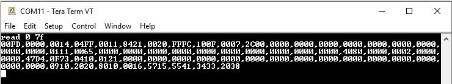
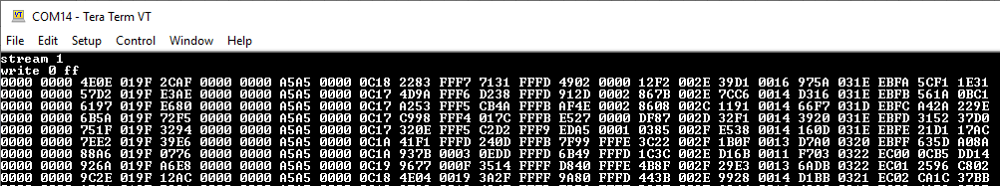

## Tutorial: Configuring The Buffer Board For Use With An ADIS1649x Module

The SPI Buffer Board includes many features that expand the ADI IMU's capabilities and make interfacing with a Linux environment more accessible. The USB CLI enables users to get started with capturing sensor data very quickly. The virtual serial port (virtual COM port) is compatible with any modern operating system and does not require any additional drivers to operate. This example walks users through configuring both the SPI buffer board and the IMU to stream data to a PC or embedded Linux device. 

### Configuring the SPI Buffer Board Using the CLI

This guide assumes that you've connected the SPI Buffer Board to the PC and opened a terminal connection to the board. The commands shown below should be typed into the console in the order shown. Note that each `write` command is designed to only write 8 bits (one byte) at a time. 

```
write 0 FD	//Change the active page to page 253
write 2 2	//Write to the BUF_CONFIG register - stop sampling when sensor data overflows, enable data capture using the IMU burst mode
write 3 0 	//Upper 8-bits of BUF_CONFIG
write 4 28	//Write the desired buffer size (correct value for ADIS1649x IMUs)
write 5 0 	//Upper 8-bits of BUF_LEN
write 8 12	//Set buffer board data ready polarity to rising edge, set buffer board data ready to DIO2
write 9 0 	//Upper 8-bits of DIO_INPUT_CONFG
write A 2	//Pass DIO2 through to the host SPI connector
write B 0 	//Upper 8-bits of DIO_OUTPUT_CONFIG 
write C 4	//Set the buffer board watermark for 4 samples
write D 0 	//Upper 8-bits of watermark
write 10 5	//Set the IMU SPI to a 5us stall
write 11 8	//Set the IMU SPI SCLK to 2.25MHz

write 0 FE	//Change the active page to page 254
write 12 0	//Write the lower byte of the burst trigger command to the request buffer
write 13 7C	//Write the upper byte of the burst trigger command to the request buffer

cmd 8		// Issue buffer board flash write command - NOTE: issuing this command will commit the current configuration to the buffer board NVM. These settings will be recalled next time the buffer board is powered on.
```

### Configuring the IMU  using the CLI

The following steps outline the minimum configuration required to capture data from an ADIS1649x IMU at a 400Hz data output rate. Additional write commands can be added to the sequence to suit your specific application.

```
write 0 3	//Change the active page to page 3 on the IMU
write 6 D	//Set the data ready output to DIO2
write 7 0 //Upper 8-bits
write C 9	//Set the datarate to 400SPS (Hz)
write D 0 //Upper 8 bits
write 2 8	//Write the lower byte of the IMU flash write command
write 3 0	//Write the upper byte of the IMU flash write command - NOTE: issuing this command will commit the current configuration to the IMU NVM. These settings will be recalled next time the buffer board is powered on
write 0 0	//Set the active IMU to page 0 - NOTE: this step is only necessary when first configuring the IMU and does not need to be performed in subsequent power cycles
```

**NOTE:** If the flash write feature on the SPI Buffer Board and IMU were used as shown above, then the configuration routines <u>do not</u> need to be executed every time at startup. 

**TIP:** The entire contents of a configuration page can be printed to the screen by issuing the following command: 

```
read 0 7F	//Read the entire contents of the active configuration page
```

Each set of four values corresponds to the contents of each 16-bit register. When executed, the output of the command should like this:



### Triggering the Data Capture

Once the buffer board and IMU have been configured, issuing the following commands in the order shown will start the data capture sequence and the data stream.

```
stream 1 	//Enable data streaming from buffer
write 0 FF	//Change the active page to page 255 to start capture
```

This will start automatic printing of each buffer sample. To put the data in a CSV format, use the "delim ," command (default delimiter is a space)



### Triggering Data Capture

To stop a data capture, send a "stream 0" command to disable streaming